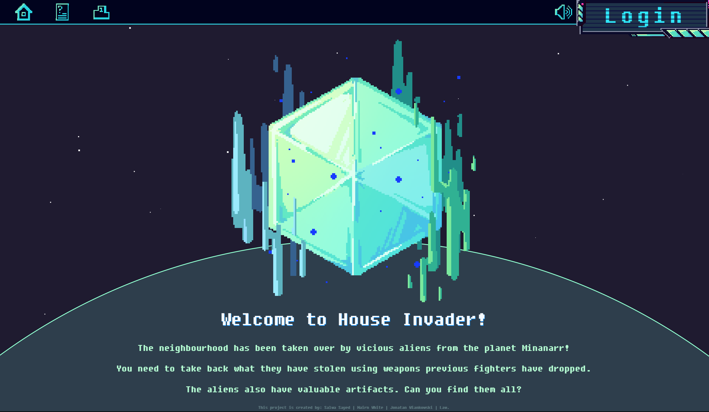
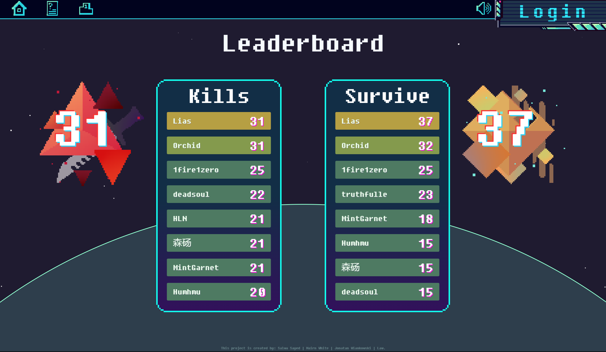
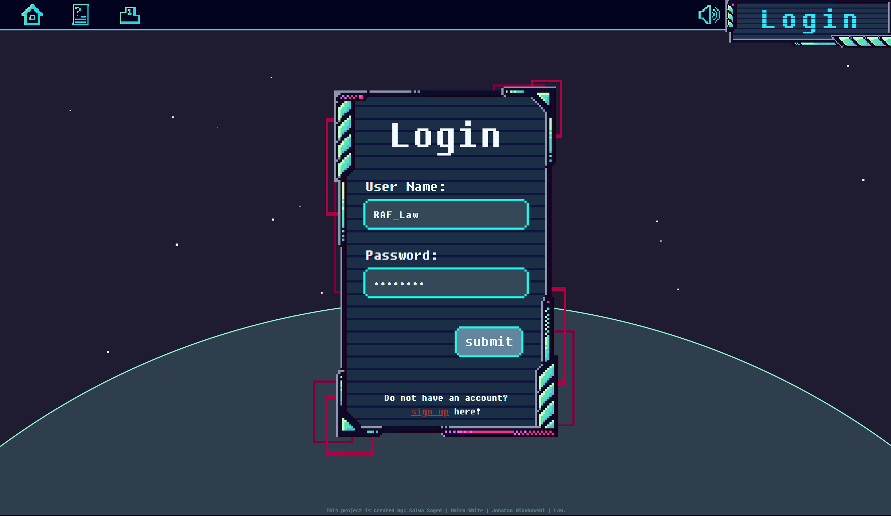
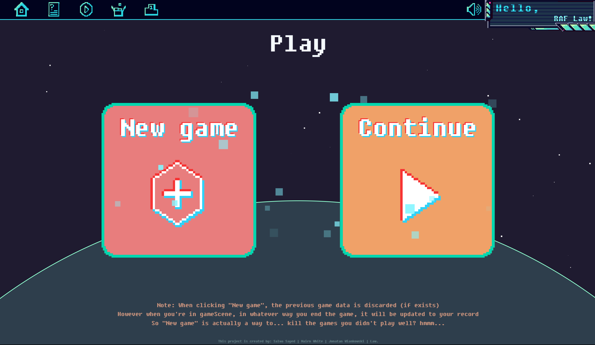
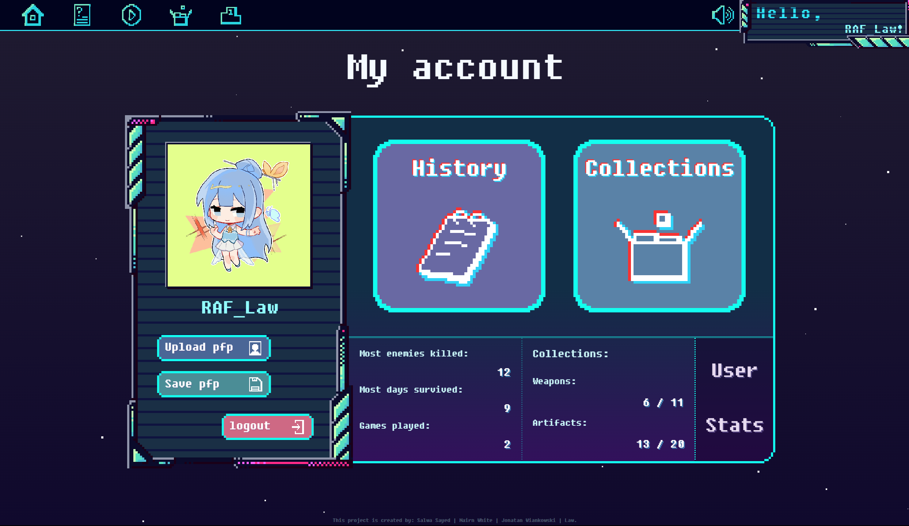
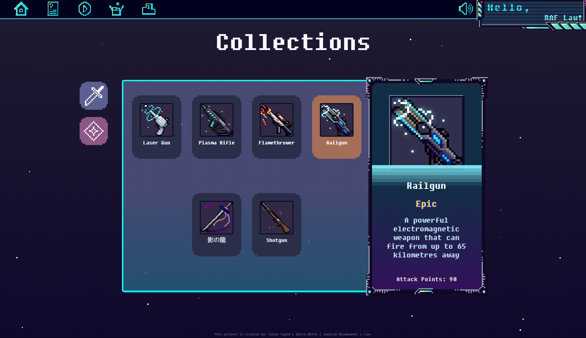

# 🏠 House Invader  
*A survival sci-fi text adventure built with Django*

**Originally served as the group project for Web App Development 2, University of Glasgow*

## Authors
- [@octokatherine](https://github.com/RAF-Law)
- [@truthfulle](https://github.com/truthfulle)  
- [@s-sayed041](https://github.com/s-sayed041)  
- [@nairn-white](https://github.com/nairn-white)  

## Game Features

### 👤 User System
- **Secure Authentication**: Registration, login, and logout functionality  
- **Custom Profiles**:
  - Profile picture uploads  
  - Game statistics tracking (kills, days survived, games played)  
  - Inventory of collected items  
- **Admin Access**: Special superuser accounts  

### 🏆 Progression & Collections
- **11 unique weapons** to discover and unlock  
- **21 mysterious artifacts** to collect  
- **Game History**: Detailed stats for past games  
- **Leaderboards**:
  - Most enemies killed  
  - Longest survival time  

### 🕹️ Gameplay
- **Persistent Game States**: Save/load progress  
- **XML Game Data Storage**  
- **Easter Egg**: Hidden Konami code feature    

### 🖼️ Media & UI
- Dynamic weapon/artifact icons  
- Responsive design  
- Action feedback system  

### ⚙️ Technical
- **Django Backend**  
- **AJAX Integration** for:
  - Game saving/loading  
  - Profile updates  
  - Inventory management  
- **Security**:
  - Login-protected views  
  - CSRF protection  
  - Password hashing  

### 🎉 Special Features
- **Konami Code**:
  - Unlocks "The Eye of Schmelborg" artifact  
  - Secret admin access  
  - Cookie persistence  
- Dynamic image loading  
- Default game state generator  

## Demo  
https://raflaw.pythonanywhere.com/gameApp/

## Run Locally

```bash
# Clone repository
git clone https://github.com/RAF-Law/alien_game

# Set up virtual environment
python -m venv venv  # use python3 if doesn't work

# Activate environment
source venv/bin/activate  # Linux/Mac
.\venv\Scripts\activate  # Windows

# Install dependencies
pip install -r requirements.txt

# Navigate to alien_game folder
cd alien_game

# ------IMPORTANT------
# Run the population script to load the weapons and artifacts
python population_script.py

# Start server
python manage.py runserver
```
Access at: http://127.0.0.1:8000/

## Screenshots













## About Arts

All art resources in this project are produced by [@octokatherine](https://github.com/RAF-Law). Besides many references from online resources, some of the artifacts have certain tributes to other works:

- Alien Artifact - Steam Hub | *Frostpunk*
- Alien Crystal - White Auracite | *Final Fantasy XIV*
- Alien Skull - Nomai Mask | *Outer Wilds*
- Extraterrestrial Relic - Warp Core | *Outer Wilds*
- Galactic Artifact - Tango with Django | *Our WAD2 textbook*
- Space Relic - Thumper | *Dune*
- Stardust - Stardust Fragment | *Terraria*
- The Dictionary of the Ancients - Enchanted Book & Enchanting Table | *Minecraft*
  
## External Resources Used
- BGM: https://pixabay.com/music/main-title-stealth-battle-205902/
- Pixelated rounded corners: https://pixelcorners.lukeb.co.uk/?radius=8&multiplier=4

## Special Thanks

To those who gave support to the development of this project and engaged in early testing:
- maxine
- Batman
- frog
- DuaLipa
- urmother
- sam
- 1fire1zero

